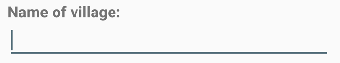
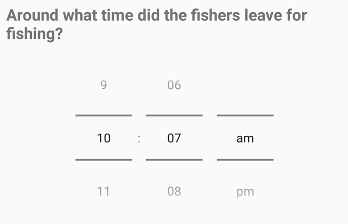
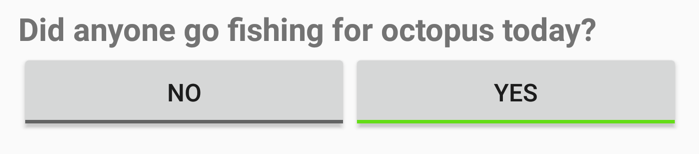
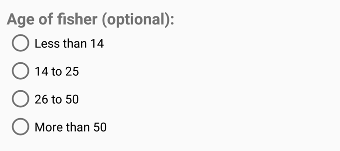
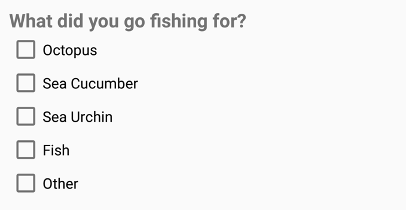

# Form  

### Note. in dev, not ready for use.

Modern replacement for [ODK Collect](https://opendatakit.org/use/collect/) forms on Android.

## Android Usage

Create a Form object from a String of json in the [format detailed below](https://github.com/fiskurgit/Form#format):

```java
Form form = FormApi.getInstance().createForm(JSON_STRING);
```

Once you have a Form object you can create the user interface by passing a ```LinearLayout```, your implementation should wrap this layout in a ```ScrollView```:

```java
LinearLayout formHolder = (LinearLayout) findViewById(R.id.form_holder);
FormApi.getInstance().buildViews(context, form, formHolder);
```

## Format

Simple Form object containing an array of fields:

```json
{
  "id": "qwerty0123456",
  "title": "Octopus Monitoring",
  "date": "05092016",
  "time": "10:49",
  "author": "Jonathan Fisher",
  "contact": "jonathan@fiskur.eu",
  "startGroupId": "start_group",
  "groups": [
    {
      "id": "start_group",
      "fields": [
        {
          "id": "Q1",
          "title": "Todays Date",
          "type": "current_date"
        }
      ]
    }
  ]
}
```

A Field is a query, question, radio buttons, checkboxes, or a non interactive section (text, or todays date):

```json
{
  "id": "Q4",
  "title": "Did anyone go fishing for octopus today?",
  "type": "binary_choice",
  "options": [
    {
      "id": "Q4N",
      "text": "No"
    },
    {
    "id": "Q4Y",
    "text": "Yes"
    }
  ]
}
```

```json
{
  "id": "Q3",
  "title": "Data Collector Name",
  "subtitle": "Choose your name from the list",
  "type": "single_choice",
  "options": [
    {
      "id": "personA",
      "text": "Person A"
    },
    {
      "id": "personB",
      "text": "Person B"
    },
    {
      "id": "personC",
      "text": "Person C"
    }
  ]
}
```

## Nesting

Different paths can be displayed based on the response to a single, multi-choice, or binary field. In order to keep the json relatively flat in structure a choice object defines a subgroup id which is displayed when that option is selected. Subgroups are held in an array at the top level, this way you can create complex form graphs without confusing heavily indented nested json.

Simple example with a single top-level field showing two alternative paths a form could take:

```json
{
  "id": "demo001",
  "title": "Octopus Monitoring",
  "date": "02112016",
  "time": "11:32",
  "author": "Jonathan Fisher",
  "contact": "jonathan@fiskur.eu",
  "startGroupId": "start_group",
  "groups": [
    {
      "id": "start_group",
      "fields": [
        {
          "id": "fish_today",
          "type": "binary_choice",
          "text": "Did anyone go fishing for octopus today?",
          "choices":
          [
            {
              "id": "fish_today_no",
              "text": "No",
              "subgroupId": "fish_today_no_subgroup"
            },
            {
              "id": "fish_today_yes",
              "text": "Yes",
              "subgroupId": "fish_today_yes_subgroup"
            }
          ]
        }
      ]
    },
    {
      "id": "fish_today_no_subgroup",
      "fields": [
        {
          "id": "fish_today_no_label",
          "type": "static_text",
          "title": "Fishing Today: No"
        }
      ]
    },
    {
      "id": "fish_today_yes_subgroup",
      "fields": [
        {
          "id": "fish_today_yes_label",
          "type": "static_text",
          "title": "Fishing Today: Yes"
        }
      ]
    }
  ]
}
```

## Available Fields

### Static Text

Use for titles, notes, explanations - any extra instruction for the end user, there's 3 fields you can use, all optional:

```json
{
  "id": "demo_intro",
  "title": "Form",
  "subtitle": "A simple replacement for ODK Collect",
  "text": "Hello world!",
  "type": "static_text"
}
```

### Text Input



Free text input from the user. 

```json
{
  "id": "TXT01",
  "text": "Sous collector name:",
  "type": "free_text"
}
```

Config options: `singleline`, `persist`, and either: `numeric`, `email`, or `phonenumber`:

```json
{
  "id": "TXT01",
  "text": "Sous collector name:",
  "type": "free_text",
  "config": "singleline|persist"
}
```


### Divider

A simple non-interactive horizontal divider to seperate two other fields.

```json
{
  "id": "D1",
  "type": "divider"
}
```

### Spacer

Invisible field to provide vertical spacing where needed.

```json
{
  "id": "SP1",
  "type": "spacer",
  "config": "160"
}
```

### Image

```json
{
  "id": "image1",
  "type": "image",
  "url": "http://fiskur.eu/apps/blueventures/oct_mantle.png"
}
```

### Current Date


A non-interactive field that displays, and returns, the current date.

```json
{
  "id": "D1",
  "type": "current_date",
  "text": "Today's Date"
}
```

### Date Picker

```json
{
  "id": "DOB1",
  "type": "date",
  "text": "Date of Birth"
}
```

### Time Picker



```json
{
  "id": "WAKE1",
  "type": "time",
  "text": "What time did you wake up?"
}
```

### Binary Yes/No Buttons



A field that allows a binary decision but displays a more prominent ui than two radio buttons.

```json
{
  "id": "work_normal",
  "type": "binary_choice",
  "text": "Did you work as normal today?",
  "choices":
  [
    {
      "id": "work_normal_no",
      "text": "No"
    },
    {
      "id": "work_normal_yes",
      "text": "Yes"
    }
  ]
}
```

### Single Choice (Radio Group)



```
{
  "id": "gender",
  "type": "single_choice",
  "text": "What gender do you identify with?",
  "choices": [
    {
      "id": "gendA",
      "text": "female"
    },
    {
      "id": "gendB",
      "text": "male"
    },
    {
      "id": "gendC",
      "text": "unspecified"
    },
    {
      "id": "gendD",
      "text": "intersex"
    },
    {
      "id": "gendE",
      "text": "prefer not to say"
    }
  ]
}
```

### Multiple Choice (Checkboxes)



```json
{
  "id": "music_genre",
  "type": "multi_choice",
  "text": "Which music genres do you enjoy?",
  "choices": [
    {
      "id": "musA",
      "text": "Avant-Garde"
    },
    {
      "id": "musB",
      "text": "Baroque"
    },
    {
      "id": "musC",
      "text": "Chamber Music"
    },
    {
      "id": "musCh",
      "text": "Choral"
    },
    {
      "id": "musCl",
      "text": "Classical Crossover"
    },
    {
      "id": "musM",
      "text": "Minimalism"
    },
    {
      "id": "musMC",
      "text": "Modern Composition"
    },
    {
      "id": "musOp",
      "text": "Opera"
    },
    {
      "id": "musR",
      "text": "Romantic"
    }
  ]
}
```

### Popup Subgroup for multiple entries - work in progress

A button field that will show a subgroup in a popup dialog, then display the completed subgroups in a list. 

```json
{
  "id": "add_octopus_multi",
  "type": "popup_subgroup",
  "text": "Add octopus catch details",
  "subgroupId": "add_octopus_subgroup"
}
```

## Localisation

An implementation of this library has a requirement for relatively obscure local/regional dialects, Android's i18n isn't sufficient so a simple dictionary api is used, if the key isn't found in the dictionary the text is displayed as-is:

```json
{
  "id": "DOB1",
  "type": "date",
  "text": "{dob}"
}
```

Example dictionary:

```json
"dictionary": [
    {
      "languageId": "english",
      "dictionary": [
        {
          "key": "{dob}",
          "text": "Date of Birth"
        },
        {
          "key": "{FORENAME_QUESTION}",
          "text": "What is your first name?"
        }
      ]
    },
      {
      "languageId": "spanish",
      "dictionary": [
        {
          "key": "{dob}",
          "text": "Fecha de nacimiento"
        },
        {
          "key": "{FORENAME_QUESTION}",
          "text": "¿cuál es tu primer nombre?"
        }
      ]
    }
  ]
}
```

### Android Implementation Details

Some notes on how the json is interpreted, the Form object is created by serialising with Gson:

```java
public Form createForm(String jsonForm){
  Gson gson = new GsonBuilder().create();
  return gson.fromJson(jsonForm, Form.class);
}
```

The implementation then passes a LinearLayout to buildView which creates the ui:

```java
public void buildViews(Context context, Form form, LinearLayout root){
//...
```

If a field contains subfields (if a choice object contains a subgroupId) then an empty LinearLayout is added beneath ready to populate when the users selected a choice, the subfield holder layout tag is the field id plus '_holder':

```java
if(field.hasSubfields()){
  LinearLayout subfieldHolder = new LinearLayout(context);
  subfieldHolder.setOrientation(LinearLayout.VERTICAL);
  subfieldHolder.setTag(String.format("%s_holder", field.id));

  LinearLayout.LayoutParams subfieldHolderLayoutParams = new LinearLayout.LayoutParams(LinearLayout.LayoutParams.MATCH_PARENT,LinearLayout.LayoutParams.WRAP_CONTENT);
  subfieldHolder.setLayoutParams(subfieldHolderLayoutParams);
  root.addView(subfieldHolder);
}
```


